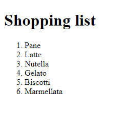

# CONSEGNA

Data una lista della spesa, stampare sulla pagina (anche brutalmente, basta che si vedano) gli elementi della lista individualmente con un ciclo while.

## SOLUZIONE

### Raccolta Dati
1. Creare array con lista della spesa
2. Creare variabile globale per l'indice
3. Creare variabile globale vuota, nella quale poter inserire il messaggio che andrà stampato in HTML

### Logica del programma 
- Ciclo while che duri **finchè** l'indice è inferiore alla lunghezza dell'array - che compia dunque tante iterazioni quanti sono gli elementi contenuti dentro l'array. 
    - Per ogni iterazione: 
        - Creare una variabile per ogni elemento corrente della spesa, che corrisponda al numero dell'iterazione 
        `
        const curShoppingItem = shoppingList[i];
        `
        - Prendere la variabile globale vuota precedentemente creata, e tramite template literal inserire l'elemento della lista HTML e la variabile corrispondente all'elemento corrente della spesa
        `
        shoppingString += '<li>${curShoppingItem}</li>'
        `
        - Incrementare i per evitare di creare un ciclo infinito
        `
        i++; 
        `
- Terminare il ciclo

### Output 
Stampare a schermo il messaggio in HTML
`
document.querySelector("ol").innerHTML = shoppingString; 
`

### Preview
;